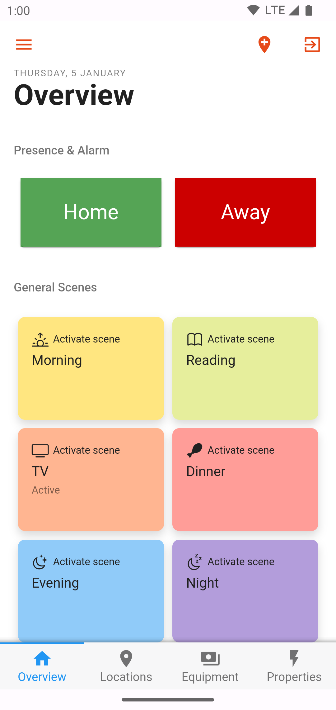
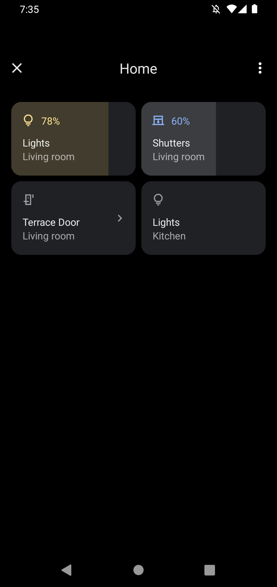



<!-- Attention authors: Do not edit directly. Please add your changes to the appropriate source repository -->

# Android App

The openHAB Android application is a native client for openHAB, compatible with phones and tablets.
The app follows the basic principles of the other openHAB UIs, like Basic UI, and presents your predefined openHAB [sitemap(s)](https://www.openhab.org/docs/configuration/sitemaps.html) and other UIs.

<a href="https://play.google.com/store/apps/details?id=org.openhab.habdroid">
  
</a>
<a href="https://f-droid.org/app/org.openhab.habdroid">
  
</a>

[[toc]]

<div class="row">
    
</div>

## Getting Started

On first start the app tries to discover your openHAB server.
This will only work on local networks and when the server doesn't enforce authentication.
If it fails, you can click on `Go to settings` and manually enter the server settings.

The URL field(s) might look like one of the following examples:

* IP address: `http://192.168.1.3:8080`
* Local hostname: `http://openhab:8080` (depending on your network the suffix `.local` needs to be added to the hostname)
* Remote domain name: `https://myopenhab.org` for an openHAB cloud account with [myopenHAB](http://www.myopenhab.org/)

**Local server settings:**
Please enter the base URL of your openHAB server, as you would enter it in the browser to reach the openHAB dashboard.

**Remote server settings:**
If your openHAB instance is reachable via a public address/domain from outside your home network, these settings will be used when the local connection is not successful.
Make sure to secure this connection against unauthorized access.
There are a number of strategies available to provide [secure remote access]({{base}}/installation/security.html) to your openHAB server.

## Features

* Control your openHAB server and/or [openHAB Cloud instance](https://github.com/openhab/openhab-cloud), e.g., an account with [myopenHAB](http://www.myopenhab.org/)
* Receive notifications through an openHAB Cloud connection, [read more](https://www.openhab.org/docs/configuration/actions.html#cloud-notification-actions)
* Change items via NFC tags
* [Send voice commands to openHAB](#send-voice-commands-to-openhab)
* [Send device information to openHAB](#send-device-information-to-openhab), like next alarm clock time or call state
* [Supports wall mounted tablets](#permanent-deployment)
* [Tasker](https://play.google.com/store/apps/details?id=net.dinglisch.android.taskerm) action plugin included
* [Android Device Controls](#device-controls)

### Permanent Deployment

If you want to use openHAB Android on a wall mounted tablet, go to settings and select `Disable display timer` and `Fullscreen`.

### Send voice commands to openHAB

It's required to have a voice recognizer app installed on the Android device, e.g. [by Google](https://play.google.com/store/apps/details?id=com.google.android.googlequicksearchbox).
Voice recognizer apps may send the recorded sound to a server to convert it into text.

To run your voice command rule please make sure that `Default Human Language Interpreter` is set to `Rule-based Interpreter` (http://openhab:8080/settings/services/org.openhab.voice) and that the correct Item is selected at `Other Services` => `Rule Voice Interpreter` => `Voice Command Item` (http://openhab:8080/settings/services/org.openhab.rulehli).

### Send device information to openHAB

You have to enable every information you want to send in the settings.
Every settings has a default item name which is also used for example item definitions and rules below.

If you have more than one device, it's recommended to fill out the [device identifier](#device-identifier) on the main settings page.
This prefixes every item name, e.g. with the Prefix `John` the item `AlarmClock` becomes `JohnAlarmClock`.
This way you don't have to change every item name.

There are two different types of information that can be send to the openHAB server:
* Event based (Alarm clock and call state)
* Schedule based (Everything else)

Event based means, that the items are updated when the corresponding event happens, e.g. the phone starts ringing.
Schedule based means, that the items are updated every 10 to 15 minutes while charging, otherwise every 2 to 6 hours.
The latter interval can be changed in the settings.

In addition devices running Android 7 or lower can also send schedule based items on specific events, e.g. a charger is plugged in.
Beginning with Android 8 it isn't possible anymore to listen for these events unless you turn on the event listener.
However this will show a persistent notification and may increase battery usage.

#### Alarm Clock

The openHAB app will send the next wake-up time from your alarm clock app to the server.

Example item definition:
```java
DateTime AlarmClock "Alarm Clock [%s]" <time>
```

```java
rule "Alarm Clock"
when
    Time is AlarmClock
then
    // Turn on stuff, e.g. radio or light
end
```

##### Limitations

The openHAB app uses the internal Android API [AlarmManager](https://developer.android.com/reference/kotlin/android/app/AlarmManager) to get the next alarm time.
Some apps use this API (e.g. the stock calendar app) for other purposes, e.g. scheduling notifications.
Therefore the openHAB app may send invalid alarm times to the server.
To circumvent this the alarm times set by some apps are blocklisted in the openHAB app and it'll send `UNDEF` instead.
It's not possible to read the time after the next.

#### Call State

Example item definition:
```java
String CallState "Call State [%s]" <soundvolume>
```

Example rule:
```java
rule "Call State"
when
    Item CallState changed
then
    if (CallState.state == "IDLE") {
        // No call activity
    } else if (CallState.state == "RINGING") {
        // A new call arrived and is ringing or waiting. In the latter case, another call is already active.
    } else if (CallState.state == "OFFHOOK") {
        // At least one call exists that is dialing, active, or on hold, and no calls are ringing or waiting.
    } else if (CallState.state == "NO_PERMISSION") {
        // The phone permission has been revoked by the user
    }
end
```

#### Battery Level

Example item definition:
```java
Number BatteryLevel "Battery Level [%d %%]" <batterylevel>
```

Example rule:
```java
rule "Battery level"
when
    Item BatteryLevel changed
then
    if (BatteryLevel.state < 25) {
        // Battery level is low
    }
end
```

#### Charging State

The charging state can be send to a `String` Item that contains the charger type or to a `Switch` Item, which is `ON` when charging, `OFF` otherwise.
The app determines the Item type automatically, so it's not required to configure the Item type in the app.

Example item definition:
```java
String ChargingState "Charging State [%s]" <poweroutlet_eu>
// or
Switch ChargingState "Charging State [%s]" <poweroutlet_eu>
```

Example rule for the `String` Item:
```java
rule "Charging state"
when
    Item ChargingState changed
then
    if (ChargingState.state == "USB") {
        // Device is charging over USB
    } else if (ChargingState.state == "AC") {
        // Device is charging over AC adapter
    } else if (ChargingState.state == "WIRELESS") {
        // Device is charging wirelessly
    } else if (ChargingState.state == "UNKNOWN_CHARGER") {
        // Device is charging in an unknown way (None of the three above).
        // If you see this state, please report that.
    } else {
        // Device isn't charging ("UNDEF" is send)
    }
end
```

#### Wi-Fi Name (SSID)

Example item definition:
```java
String WifiName "Wi-Fi Name [%s]" <network>
```

Example rule:
```java
rule "Wi-Fi name"
when
    Item WifiName changed
then
    if (WifiName.state == UNDEF) {
        // Device isn't connected to Wi-Fi
    } else if (WifiName.state == "LOCATION_OFF") {
        // On Android 8 and higher "Location" must be turned on, otherwise apps don't have access to the Wi-Fi SSID
    } else if (WifiName.state == "NO_PERMISSION") {
        // The location permission has been revoked by the user
    } else {
        logInfo("WIFI", "Device is connected to Wi-Fi " + WifiName.state)
    }
end
```

#### Bluetooth devices

Send a `|` separated list of MAC addresses of connected bluetooth devices.

Example item definition:
```java
String BluetoothDevices "Bluetooth devices [%s]" <bluetooth>
```

Example rule:
```java
rule "Bluetooth devices"
when
    Item BluetoothDevices changed
then
    if (WifiName.state == UNDEF) {
        // No device is connected
    } else if (WifiName.state == "NO_PERMISSION") {
        // The bluetooth permission has been revoked by the user
    } else {
        logInfo("BluetoothDevices", "Connected Bluetooth devices: " + BluetoothDevices.state)
    }
end
```

#### DND Mode

Sending the DND mode requires Android 6 or higher.

Example item definition:
```java
String DndMode "DND Mode [%s]" <soundvolume_mute>
```

Example rule:
```java
rule "DND mode"
when
    Item DndMode changed
then
    if (DndMode.state == "TOTAL_SILENCE") {
        // All notifications are suppressed
    } else if (DndMode.state == "PRIORITY") {
        // All notifications are suppressed except those that match the priority criteria
    } else if (DndMode.state == "ALARMS") {
        // All notifications are suppressed except alarms
    } else if (DndMode.state == "OFF") {
        // No notifications are suppressed
    } else {
        // DND mode is unknown
    }
end
```

#### Gadgetbridge Device Actions

[Gadgetbridge](https://www.gadgetbridge.org/) can send an Android broadcast on some actions of a wearable and openHAB can listen for these broadcasts to update an Item accordingly.
Please keep the default values for broadcasts in Gadgetbridge.

Example item definition:
```java
String Gadgetbridge "Wearable [%s]"
```

Example rule:
```java
rule "Gadgetbridge"
when
    Item Gadgetbridge changed
then
    if (Gadgetbridge.state == "FellAsleep") {
        // The wearable recorded "FallAsleep"
    } else if (Gadgetbridge.state == "WokeUp") {
        // The wearable recorded "WokeUp"
    } else if (Gadgetbridge.state == "StartNonWear") {
        // The wearable recorded "StartNonWear"
    }
end
```

### Device identifier

The device identifier can be any string and should be unique for all devices accessing your openHAB server.
You can use it to distinguish between multiple clients:
* Prefix the voice command with `<Device identifier>|`
* Prefix the item names of [Send device information to openHAB](#send-device-information-to-openhab)
* Use it as state on NFC tags

### Tasker Action Plugin

The Tasker Action Plugin can be used to send Item commands to the server.

For security reasons the plugin is disabled by default.
You can enable it by clicking on "Turn on" when trying to select an Item or go to the openHAB app settings and turn on "Tasker integration".

Variables can be selected as state after they have been created in the task.
The variable `%httpcode` is returned by the plugin and contains the HTTP code returned by the server.

In case of an error the plugin returns an error code.

| Error Code | Description                                                                                                                                                                                                |
|------------|------------------------------------------------------------------------------------------------------------------------------------------------------------------------------------------------------------|
| 10         | Tasker plugin is disabled                                                                                                                                                                                  |
| 11         | The app couldn't establish a connection                                                                                                                                                                    |
| > 1000     | A connection was established, but an error occurred. The error code is 1000 + the HTTP code, e.g. 1401 means [Unauthenticated](https://en.wikipedia.org/wiki/List_of_HTTP_status_codes#4xx_client_errors). |

### Device Controls



openHAB supports the device controls introduced in Android 11: https://developer.android.com/develop/ui/views/device-control
When using a [semantic model](https://www.openhab.org/docs/tutorial/model.html#semantic-model) the location and/or equipment name can be shown in the tiles.
The icon in the tiles is based on the semantic class of the Item.

You can configure the page that is opened when you long-press a tile.
Create an "Android App: Device Controls" metadata on an Item with a link without the host to a Sitemap (e.g. `/basicui/app?w=0202&sitemap=demo`) or MainUI (e.g. `/locations`).

### UI command Item

Similar to the [UI command Item in Main UI](https://next.openhab.org/docs/mainui/about.html#ui-command-item) you can use a `String` Item to control the Sitemaps.
Whenever the configured Item receives a command, the app reacts on this command.
Examples:
- Sending the command `navigate:/basicui/app?w=0003&sitemap=foo` opens a subpage of the Sitemap `foo`. To get this URL, open the Sitemap in Basic UI and copy the URL after the hostname.
- Sending the command `notification:Hi there` shows a popup with this text.

All commands except the `popup:` command are supported by the app.

## Multi server support

When adding multiple servers to the app, there's always a primary and an active one.
The active server is used for foreground operations, e.g. display the Sitemaps, and can be changed in the side menu.
The primary server is used for all background operations and can be changed in the settings.

Features that support multiple servers:
* Display Sitemaps and HABPanel
* Voice commands launched from in-app (sent to active server) and from widgets (sent to primary server)
* Show a list of recent notifications
* Sitemap shortcuts on the home screen
* Shortcuts for HABPanel, notifications and voice command

Features that don't support multiple servers, i.e. use the primary server:
* Item widgets on the home screen
* Quick tiles
* NFC tags
* Push notifications
* Send device information to openHAB
* Tasker plugin

## Help and Technical Details

Please refer to the [openhab-android project on GitHub](https://github.com/openhab/openhab-android) for more details.

### I don't receive any notifications

Please have a look at the notification status on the settings screen in the app.
If it claims that your device is successfully registered at FCM, please open an issue on [openhab-android project on GitHub](https://github.com/openhab/openhab-android) or create a thread in the forum.

### My notifications are delayed

All notifications are sent as "high priority" messages, which means that the device and the openHAB app are waken up and display the notification.
However vendors/third parties can implement custom "cleanup", "optimization" and "battery saver" apps, which might lead to delayed notifications.
Please have a look at [dontkillmyapp.com](https://dontkillmyapp.com/) how to make an exception for openHAB in these apps.

### Notifications in FOSS version

The version on Play Store uses [FCM](https://en.wikipedia.org/wiki/Firebase_Cloud_Messaging) to receive push notifications in real time.
In the FOSS version this library has to be removed and has been replaced by a polling mechanism.
This has a few disadvantages:
* Notifications are only fetched every 6 hours by default. It uses the same schedule than [Send device information to openHAB](#send-device-information-to-openhab).
* Read status aren't synced between devices.
* The maximum number of messages that can be received during one fetch is limited to 20.

### I have issues with Main UI or HABPanel

The app uses the WebView component of the Android system to render all UIs except Sitemaps.
If something is rendered different than in the browser on your mobile device, you can try to update the default WebView implementation (https://play.google.com/store/apps/details?id=com.google.android.webview) or switch to a different implementation.
To do so, enable [developer settings options](https://developer.android.com/studio/debug/dev-options) then go to the developer settings and select "WebView implementation".

### Chart loading is too slow

Generating charts can be taxing to the server.
If you experience slow chart loading times and your server isn't powerful, open `Settings` and disable `High resolution charts` to improve loading times.

### Icons look pixelated

For good looking icons, the best approach is using SVG icons.
Bitmap icons have a fixed size that doesn't scale with screen pixel density, so depending on the device, they may be scaled up by a large factor.
When using SVG icons, ideally use icons that don't have a fixed size (in other words, they shouldn't have a 'width' and 'height' attribute on the root tag), as otherwise scaling might become necessary again: the app renders SVGs at their native size scaled by screen density, but scales them to a common size; when using icons without fixed size, the app can render them at precisely the needed size.

## Trademark Disclaimer

Google Play and the Google Play logo are trademarks of Google Inc.
