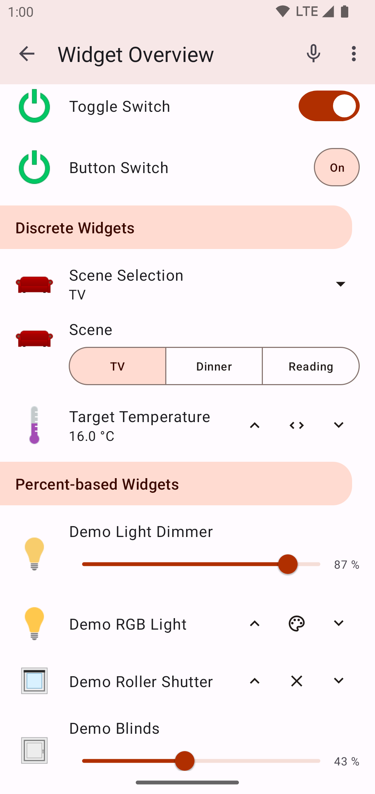



<!-- Attention authors: Do not edit directly. Please add your changes to the appropriate source repository -->

# Android App

The openHAB Android application is a native client for openHAB, compatible with phones and tablets.
The app follows the basic principles of the other openHAB UIs, like Basic UI, and presents your predefined openHAB [sitemap(s)](https://www.openhab.org/docs/configuration/sitemaps.html).

<a href="https://play.google.com/store/apps/details?id=org.openhab.habdroid">
  
</a>
<a href="https://f-droid.org/app/org.openhab.habdroid">
  
</a>

[[toc]]

<div class="row">
    
</div>

## Getting Started

On first start the app tries to discover your openHAB server.
This will only work on local networks and when the server does not enforce either authentication or HTTPS.
If it fails, you can click on `Go to settings` and manually enter the server settings.

The URL field(s) might look like one of the following examples:

* IP address: `http://192.168.1.3:8080`
* Local hostname: `http://openhabianpi:8080` (depending on your network the suffix `.local` needs to be added to the hostname)
* Remote domain name: `https://myopenhab.org` for an openHAB cloud account with [myopenHAB](http://www.myopenhab.org/)

**Local server settings:**
Please enter the base URL of your openHAB server, as you would enter it in the browser to reach the openHAB dashboard.

**Remote server settings:**
If your openHAB instance is reachable via a public address/domain from outside your home network, these settings will be used when the local connection is not successful.
Make sure to secure this connection against unauthorized access.
There are a number of strategies available to provide [secure remote access]({{base}}/installation/security.html) to your openHAB server.

## Features

* Control your openHAB server and/or [openHAB Cloud instance](https://github.com/openhab/openhab-cloud), e.g., an account with [myopenHAB](http://www.myopenhab.org/)
* Receive notifications through an openHAB Cloud connection, [read more](https://www.openhab.org/docs/configuration/actions.html#cloud-notification-actions)
* Change items via NFC tags
* Send voice commands to openHAB
* [Send device information to openHAB](#send-device-information-to-openhab), like next alarm clock time or call state
* [Supports wall mounted tablets](#permanent-deployment)
* [Tasker](https://play.google.com/store/apps/details?id=net.dinglisch.android.taskerm) action plugin included

### Permanent Deployment

If you want to use openHAB Android on a wall mounted tablet, go to settings and select `Disable display timer` and `Fullscreen`.

### Send device information to openHAB

You have to enable every information you want to send in the settings.
Every settings has a default item name which is also used for example item definitions and rules below.

If you have more than one device, it's recommended to fill out the [device identifier](#device-identifier) on the main settings page.
This prefixes every item name, e.g. with the Prefix `John` the item `AlarmClock` becomes `JohnAlarmClock`.
This way you don't have to change every item name.

There are two different types of information that can be send to the openHAB server:
* Event based (Alarm clock and call state)
* Schedule based (Everything else)

Event based means, that the items are updated when the corresponding event happens, e.g. the phone starts ringing.
Schedule based means, that the items are updated every 10 to 15 minutes while charging, otherwise every 2 to 6 hours.
The latter interval can be changed in the settings.

In addition devices running Android 7 or lower can also send schedule based items on specific events, e.g. a charger is plugged in.
Beginning with Android 8 it isn't possible anymore to listen for these events unless you turn on the event listener.
However this will show a persistent notification and may increase battery usage.

#### Alarm Clock

The openHAB app will send the next wake-up time from your alarm clock app to the server.
The time is sent as a number containing the number of milliseconds since the epoch.

Example item definition:
```java
DateTime AlarmClock "Alarm Clock [%s]" <time>
```

Example rule:
```java
var Timer timerAlarm = null

rule "Alarm Clock"
when
    Item AlarmClock changed
then
    if (newState instanceof DateTimeType) {
        val epoch = newState.toLocaleZone.zonedDateTime.toInstant.toEpochMilli
        logInfo("alarm", "Scheduling alarm for {} ({})", newState.toLocaleZone, epoch)
        if (timerAlarm !== null) {
            logInfo("alarm", "Reschedule alarm")
            timerAlarm.reschedule(new DateTime(epoch))
        } else {
            logInfo("alarm", "New alarm")
            timerAlarm = createTimer(new DateTime(epoch), [ |
				// Turn on stuff, e.g. radio or light
                logInfo("alarm", "Alarm expired")
                timerAlarm = null
            ])
        }
    } else {
        if (timerAlarm !== null) {
            timerAlarm.cancel
            timerAlarm = null
        }
        logInfo("alarm", "Alarm canceled")
    }
end
```

#### Call State

Example item definition:
```java
String CallState "Call State [%s]" <soundvolume>
```

Example rule:
```java
rule "Call State"
when
    Item CallState changed
then
    if (CallState.state == "IDLE") {
        // No call activity
    } else if (CallState.state == "RINGING") {
        // A new call arrived and is ringing or waiting. In the latter case, another call is already active.
    } else if (CallState.state == "OFFHOOK") {
        // At least one call exists that is dialing, active, or on hold, and no calls are ringing or waiting.
    }
end
```

#### Battery Level

Example item definition:
```java
Number BatteryLevel "Battery Level [%d %%]" <batterylevel>
```

Example rule:
```java
rule "Battery level"
when
    Item BatteryLevel changed
then
    if (BatteryLevel.state < 25) {
        // Battery level is low
    }
end
```

#### Charging State

Example item definition:
```java
String ChargingState "Charging State [%s]" <poweroutlet_eu>
```

Example rule:
```java
rule "Charging state"
when
    Item ChargingState changed
then
    if (ChargingState.state == "USB") {
        // Device is charging over USB
    } else if (ChargingState.state == "AC") {
        // Device is charging over AC adapter
    } else if (ChargingState.state == "WIRELESS") {
        // Device is charging wirelessly
    } else if (ChargingState.state == "UNKNOWN_CHARGER") {
        // Device is charging in an unknown way (None of the three above).
        // If you see this state, please report that.
    } else {
        // Device isn't charging ("UNDEF" is send)
    }
end
```

#### Wi-Fi Name (SSID)

Example item definition:
```java
String WifiName "Wi-Fi Name [%s]" <network>
```

Example rule:
```java
rule "Wi-Fi name"
when
    Item WifiName changed
then
    if (WifiName.state == "UNDEF") {
        // Device isn't connected to Wi-Fi
    } else if (WifiName.state == "LOCATION_OFF") {
        // On Android 8 and higher "Location" must be turned on, otherwise apps don't have access to the Wi-Fi SSID
    } else if (WifiName.state == "NO_PERMISSION") {
        // The location permission has been revoked by the user
    } else {
        logInfo("WIFI", "Device is connected to Wi-Fi " + WifiName.state)
    }
end
```

#### DND Mode

Sending the DND mode requires Android 6 or higher.

Example item definition:
```java
String DndMode "DND Mode [%s]" <soundvolume_mute>
```

Example rule:
```java
rule "DND mode"
when
    Item DndMode changed
then
    if (DndMode.state == "TOTAL_SILENCE") {
        // All notifications are suppressed
    } else if (DndMode.state == "PRIORITY") {
        // All notifications are suppressed except those that match the priority criteria
    } else if (DndMode.state == "ALARMS") {
        // All notifications are suppressed except alarms
    } else if (DndMode.state == "OFF") {
        // No notifications are suppressed
    } else {
        // DND mode is unknown
    }
end
```

### Device identifier

The device identifier can be any string and should be unique for all devices accessing your openHAB server.
You can use it to distinguish between multiple clients:
* Prefix the voice command with `<Device identifier>|`
* Prefix the item names of [Send device information to openHAB](#send-device-information-to-openhab)
* Use it as state on NFC tags

### Tasker Action Plugin

The Tasker Action Plugin can be used to send Item commands to the server.

For security reasons the plugin is disabled by default.
You can enable it by clicking on "Turn on" when trying to select an Item or go to the openHAB app settings and turn on "Tasker integration".

Variables can be selected as state after they have been created in the task.
The variable `%httpcode` is returned by the plugin and contains the HTTP code returned by the server.

In case of an error the plugin returns an error code.

| Error Code | Description                                                                                |
| ---------- | ------------------------------------------------------------------------------------------ |
| 10         | Tasker plugin is disabled                                                                  |
| 11         | The app couldn't establish a connection                                                    |
| 1000+      | A connection was established, but an error occured. The error code is 1000 + the HTTP code |

## Help and Technical Details

Please refer to the [openhab-android project on GitHub](https://github.com/openhab/openhab-android) for more details.

### I don't receive any notifications

Please have a look at the "Push notification status" on the About screen in the app.
If it claims that your device is successfully registered at FCM, please open an issue on [openhab-android project on GitHub](https://github.com/openhab/openhab-android) or create a thread in the forum.

### My notifications are delayed

All notifications are sent as "high priority" messages, which means that the device and the openHAB app are waken up and display the notification.
However vendors/third parties can implement custom "cleanup", "optimization" and "battery saver" apps, which might lead to delayed notifications.
Please have a look at [dontkillmyapp.com](https://dontkillmyapp.com/) how to make an exception for openHAB in these apps.

### Notifications in FOSS version

The version on Play Store uses [FCM](https://en.wikipedia.org/wiki/Firebase_Cloud_Messaging) to receive push notifications in real time.
In the FOSS version this library has to be removed and has been replaced by a polling mechanism.
This has a few disadvantages:
* Notifications are only fetched every 6 hours by default. It uses the same schedule than [Send device information to openHAB](#send-device-information-to-openhab).
* Read status aren't synced between devices.
* The maximum number of messages that can be received during one fetch is limited to 20.

### My voice command rule isn't run

Please make sure `Default Human Language Interpreter` is set to `Rule-based Interpreter` (http://openhab:8080/paperui/index.html#/configuration/system) and `Rule Voice Interpreter` => `Configure` => Select correct item (http://openhab:8080/paperui/index.html#/configuration/services?tab=voice).

### Chart loading is too slow

Generating charts can be taxing to the server.
If you experience slow chart loading times and your server isn't powerful, open `Settings` and disable `High resolution charts` to improve loading times.

## Trademark Disclaimer

Google Play and the Google Play logo are trademarks of Google Inc.
